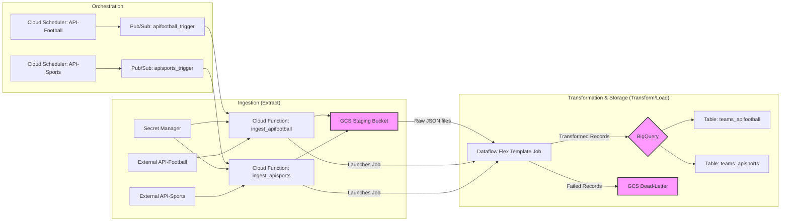
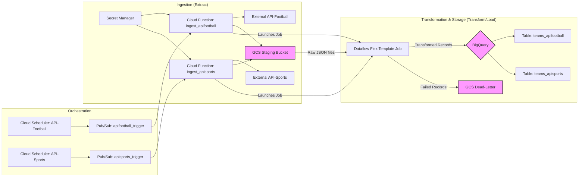

# Football ETL Pipeline

## Overview

This project implements a robust serverless ETL (Extract, Transform, Load) pipeline on Google Cloud Platform. Its purpose is to ingest, standardize, and store Football team and season performance data from two separate external APIs:

*   **API-Sports** (Football API v3)
*   **API-Football**

The pipeline is designed to be scalable, resilient, and automated, leveraging serverless components for cost-efficiency and ease of management.
## Architecture and Design

The pipeline follows a decoupled, event-driven architecture that separates the ingestion, transformation, and storage stages. This modular design enhances clarity and maintainability.


### Data Flow

1. **Orchestration (Scheduling)**: Two Cloud Scheduler jobs run on a defined cron schedule, initiating the pipeline for each of the two APIs.
2. **Triggering**: Each scheduler job publishes a simple JSON message (e.g., `{"leagues": [39]}`) to a dedicated Pub/Sub topic. This decouples the scheduler from the data ingestion logic.
3. **Ingestion (Extract)**: Two separate Cloud Functions (`ingest_apifootball` and `ingest_apisports`) are subscribed to their respective Pub/Sub topics. When a message is received, the corresponding function is triggered.
4. **API Fetching**: The Cloud Function fetches team and standings data from its designated external API. The client logic includes a retry mechanism for transient network errors.
5. **Staging (Load Raw Data)**: The raw, unprocessed JSON data from the APIs is immediately uploaded to a staging bucket in Google Cloud Storage (GCS). Files are organized by API, season, league, and a unique run ID.
6. **Transformation Trigger**: Upon successful upload of the raw data, the ingestion Cloud Function launches a Dataflow Flex Template job, passing the GCS paths of the new files as runtime parameters.
7. **Transformation (Dataflow)**: The Apache Beam pipeline, running on Dataflow, performs the core transformation logic:
    *   It reads the staged JSON files from GCS.
    *   It joins the `teams` data with the `standings` data for each league.
    *   It transforms and normalizes the data from each source into a single by utilized standardized schema.
    *   It validates each record against the schema, ensuring data types are correct and required fields are present.
8. **Storage (Load Transformed Data)**: The clean, transformed data is streamed into two separate BigQuery tables (one for each API source). This allows for easy comparison and analysis while maintaining data provenance.
9. **Dead-Letter Handling**: If any record fails during the Dataflow transformation (e.g., due to a schema mismatch or corrupted data), it is automatically routed to a "dead-letter" directory in GCS for later inspection, preventing a single bad record from failing the entire pipeline.

### Technology Choices

* **Cloud Functions & BigQuery**: These were used as **explicitly suggested** in the assignment's "A Most" section. Cloud Functions are ideal for the event-driven ingestion task, while BigQuery serves as a powerful, scalable data warehouse for the final structured data.
* **Dataflow (vs. Dataproc)**: The assignment suggested either Dataproc or another tool for transformation. Dataflow was chosen over Dataproc because:
	* its Flex Template feature is a better fit for this unify data from different sources. It significantly simplify adding new API sources while ensure uniform structure in normalized level.
	* This avoids managing a persistent cluster, simplifying operations and reducing costs which would be required with Dataproc.
* **Serverless Architecture & Cost**: The entire architecture is serverless which is highly cost-effective. Costs are incurred only on execution, meaning there are no idle resources consuming budget. 
* **Secret Manager**: Used to securely store API keys, fulfilling the need for a robust and secure design by externalizing sensitive configuration.
* **Google Cloud Storage (GCS)**: A durable and cost-effective object store, ideal for staging raw data before it undergoes transformation, while not loosing any data and support historic loads. 
### Data Schema 
A single, standardized schema is used to normalize the data from both APIs into a consistent format. This ensures that the final datasets are clean, predictable, and ready for analysis.
For a detailed breakdown of each field, design decisions, and how data from the source APIs is mapped, please see the dedicated schema documentation:
**➡️ [View Detailed Schema Documentation](./SCHEMA.md)**
### Security and Fine-Grained Permissions 
Pipeline is designed with security at its core, adhering to the **Principle of Least Privilege**. Instead of using a single, overly-permissive service account, the infrastructure is segregated into distinct roles, each with the minimum set of permissions required. This is implemented through three dedicated Google Cloud Service Accounts:
* **Scheduler Service Account (`sa-pipeline-scheduler`)**: This account is used exclusively by Cloud Scheduler. Its only permission is `pubsub.publisher`, allowing it to publish trigger messages. It cannot access secrets, storage, or data.
* **Ingestion Service Account (`sa-ingest-function`)**: This account is assigned to the Cloud Functions. It is granted a limited set of permissions to access specific secrets (`secretmanager.secretAccessor`), write to the GCS staging bucket (`storage.objectUser`), and launch Dataflow jobs (`dataflow.developer`).
* **Dataflow Service Account (`sa-dataflow-job`)**: This is the identity the Dataflow workers assume. Its permissions are scoped to read from the GCS staging bucket, read container images, and write data into BigQuery (`bigquery.dataEditor`, `bigquery.jobUser`).
This separation ensures that a compromise of one component (e.g., the scheduler) does not grant an attacker access to sensitive data or other parts of the pipeline. All permissions are granted programmatically in the `infra_setup.sh` script, ensuring a repeatable and auditable security posture.
### Error Handling and Logging 
  
* **Ingestion (Cloud Functions)**: All operations within the Cloud Functions are logged as structured JSON to Google Cloud Logging. This provides clear, filterable logs for monitoring and debugging. 
* **Transformation (Dataflow)**: The Dataflow pipeline includes a robust dead-letter mechanism. Any record that fails validation is automatically sent to a dead-letter location in GCS (`gs://<your-bucket>/dataflow/temp/dead_letter/`), ensuring data quality in BigQuery.

### Bonus points clarifications
This project is designed with the bonus tasks in mind and provides a strong foundation for implementing them.
1.  **Data-Monitoring Dashboard**: The pipeline already emits structured logs to **Google Cloud Logging** for every key stage (ingestion, API calls, errors, Dataflow job launch). These logs contain crucial metadata like API latency, record counts, and error reasons. This data can be directly used to build a monitoring dashboard in **Looker Studio** or **Cloud Monitoring** by creating log-based metrics and alerts, fulfilling this requirement with minimal additional code.

2.  **Schema Evolution**: While schema design explicitly includes a `schema_version` field in every record. The Dataflow pipeline can be easily extended to:
    * Dynamically select the correct transformation logic based on the schema version. (see `pipelines.py` file)
    * Maintain historical data by loading records into BigQuery tables partitioned by the `schema_version` field.

This design ensures that the pipeline can adapt to future changes in the source APIs without requiring a full rewrite or data backfill.
## Getting Started

Follow these instructions to set up and deploy the pipeline in your own Google Cloud project.
### Prerequisites

* A Google Cloud Project with billing enabled.
* The `gcloud` command-line tool installed and configured.
* API keys for both [API-Football](https://apifootball.com/) and [API-Sports](https://api-sports.io/).

### Configuration

1.  **Clone the Repository**
    ```bash
    git clone <your-repository-url>
    cd <repository-directory>
    ```

2.  **Configure Google Cloud**
    ```bash
    gcloud auth login
    gcloud config set project YOUR_PROJECT_ID
    ```

3.  **Create `.env` file**
    Create a file named `.env` in the project's root directory and add your API keys. This file is used by `infra_setup.sh` to populate Secret Manager and is securely ignored by git.
    ```
    # .env
    APIFOOTBALL_KEY="your_api_football_key_here"
    APISPORTS_KEY="your_api_sports_key_here"
    ```

4.  **Review `config.sh`**
    Most variables in `config.sh` are derived automatically from your `gcloud` project configuration. You may review it to change the region, bucket name, or other settings.

## How to Run the Pipeline

The deployment is a two-step process: first, set up the core infrastructure, and second, deploy the application logic (Cloud Functions and Schedulers).

### Step 1: Set Up Infrastructure

This script is idempotent and can be run safely multiple times. It enables the necessary APIs, creates service accounts with fine-grained permissions, sets up storage, and builds the Dataflow template.
**Important**: the file was updated as the development go, the final version was not tested on clean project.  
```bash
chmod +x infra_setup.sh
bash infra_setup.sh
```
This script will:
*   Enable all required GCP APIs.
*   Create a GCS bucket for staging.
*   Create Pub/Sub topics for triggering.
*   Create and populate secrets in Secret Manager using your `.env` file.
*   Create dedicated Service Accounts for the scheduler, ingestion functions, and Dataflow jobs with the principle of least privilege.
*   Build and upload the Dataflow Flex Template to GCS.

### Step 2: Deploy Ingestion Logic and Schedulers

This script deploys the Cloud Functions and sets up the Cloud Scheduler jobs that will run the pipeline automatically.

```bash
bash ingestion/deploy.sh
```

This script will:
*   Deploy the `ingest_apifootball` and `ingest_apisports` Cloud Functions.
*   Create or update the Cloud Scheduler jobs to trigger these functions on the schedule defined in `config.sh`.
#### Manual Trigger

You can manually trigger the pipeline for a specific API by publishing a message to its Pub/Sub topic:

```bash
# Trigger API-Football for Premier League (ID 153)
gcloud pubsub topics publish ingest_apifootball_trigger --message "{\"leagues\":'[153]'}"

# Trigger API-Sports for Premier League (ID 39) for the 2023 season
gcloud pubsub topics publish ingest_apisports_trigger --message "{\"leagues\":'[39]', \"season\": 2023}"
```

## Error Handling and Logging

* **Ingestion (Cloud Functions)**: All operations within the Cloud Functions are logged as structured JSON to Google Cloud Logging, providing clear, filterable logs. API clients have a built-in retry mechanism for transient errors. If an unrecoverable error occurs during file upload, a rollback function attempts to clean up any partially staged files in GCS to prevent orphaned data.
* **Transformation (Dataflow)**: The Dataflow pipeline includes a robust dead-letter mechanism. Any record that fails during processing (e.g., due to a schema validation error) is automatically sent to a dead-letter location in GCS (`gs://<your-bucket>/dataflow/temp/dead_letter/`). This ensures that the main pipeline is not blocked by a few bad records.


***

### `/README.md`

````markdown
# Premier League ETL Pipeline

## Overview

This project implements a robust, event-driven ETL (Extract, Transform, Load) pipeline on Google Cloud Platform. Its purpose is to ingest, standardize, and store Premier League team and season performance data from two separate external APIs:

*   **API-Sports** (Football API v3)
*   **API-Football**

The pipeline is designed to be scalable, resilient, and automated, leveraging serverless components for cost-efficiency and ease of management, directly addressing the core requirements of the assignment.

## Architecture and Design

The pipeline follows a decoupled, event-driven architecture that separates the ingestion, transformation, and storage stages. This modular design enhances clarity and maintainability.



### Data Flow

1.  **Orchestration (Scheduling)**: Two Cloud Scheduler jobs run on a defined cron schedule, initiating the pipeline for each of the two APIs.
2.  **Triggering**: Each scheduler job publishes a simple JSON message to a dedicated Pub/Sub topic. This decouples the scheduler from the data ingestion logic.
3.  **Ingestion (Extract)**: Two separate Cloud Functions (`ingest_apifootball` and `ingest_apisports`) are subscribed to their respective Pub/Sub topics. When a message is received, the corresponding function is triggered.
4.  **API Fetching**: The Cloud Function securely retrieves API keys from Secret Manager and fetches team and standings data from its designated external API.
5.  **Staging (Load Raw Data)**: The raw JSON data from the APIs is immediately uploaded to a staging bucket in Google Cloud Storage (GCS), organized by API, season, and league.
6.  **Transformation Trigger**: Upon successful upload, the ingestion Cloud Function launches a Dataflow Flex Template job, passing the GCS paths of the new files as runtime parameters.
7.  **Transformation (Dataflow)**: The Apache Beam pipeline, running on Dataflow, performs the core transformation logic: reading, joining, normalizing, and validating the data against the standard schema.
8.  **Storage (Load Transformed Data)**: The clean, transformed data is streamed into two separate BigQuery tables (one for each API source) to maintain clear data provenance.
9.  **Dead-Letter Handling**: Any record that fails during the Dataflow transformation is automatically routed to a "dead-letter" directory in GCS for later inspection.

### Technology Choices

The selection of Google Cloud services was guided directly by the assignment's requirements, with a focus on serverless, managed solutions to ensure robustness, scalability, and cost-effectiveness.

*   **Cloud Functions & BigQuery**: These were used as **explicitly suggested** in the assignment's "A Most" section. Cloud Functions are ideal for the event-driven ingestion task, while BigQuery serves as a powerful, scalable data warehouse for the final structured data.
*   **Dataflow (vs. Dataproc)**: The assignment suggested either Dataproc or another tool for transformation. Dataflow was chosen over Dataproc because its fully managed, serverless nature is a better fit for this event-driven architecture. It automatically handles resource provisioning and scaling, simplifying operations and reducing costs, as you only pay for the processing time used. This avoids managing a persistent cluster, which would be required with Dataproc.
*   **Serverless Architecture & Cost**: The entire architecture (Cloud Scheduler, Pub/Sub, Functions, Dataflow, BigQuery) is serverless. This is highly cost-effective and aligns with the "Stay within the free tier" constraint. Costs are incurred only on execution, meaning there are no idle resources consuming budget. The generous free tiers for these services make it possible to run this pipeline at little to no cost for the specified scale.
*   **Secret Manager**: Used to securely store API keys, fulfilling the need for a robust and secure design by externalizing sensitive configuration.
*   **Google Cloud Storage (GCS)**: A durable and cost-effective object store, ideal for staging raw data before it undergoes transformation.

### Data Schema

A single, standardized schema is used to normalize the data from both APIs into a consistent format. This ensures that the final datasets are clean, predictable, and ready for analysis.

For a detailed breakdown of each field, design decisions, and how data from the source APIs is mapped, please see the dedicated schema documentation:

**➡️ [View Detailed Schema Documentation](./SCHEMA.md)**

## Getting Started

Follow these instructions to set up and deploy the pipeline in your own Google Cloud project.

### Prerequisites

*   A Google Cloud Project with billing enabled.
*   The `gcloud` command-line tool installed and configured.
*   API keys for both [API-Football](https://apifootball.com/) and [API-Sports](https://api-sports.io/).
*   A Bash shell (like Git Bash on Windows).

### Configuration

1.  **Clone the Repository**
    ```bash
    git clone <your-repository-url>
    cd <repository-directory>
    ```

2.  **Configure Google Cloud**
    ```bash
    gcloud auth login
    gcloud config set project YOUR_PROJECT_ID
    ```

3.  **Create `.env` file**
    Create a file named `.env` in the project's root directory and add your API keys. This file is used by `infra_setup.sh` to populate Secret Manager and is securely ignored by git.
    ```
    # .env
    APIFOOTBALL_KEY="your_api_football_key_here"
    APISPORTS_KEY="your_api_sports_key_here"
    ```

4.  **Review `config.sh`**
    Most variables in `config.sh` are derived automatically from your `gcloud` project configuration. You may review it to change the region, bucket name, or other settings.

## How to Run the Pipeline

The deployment is a two-step process: first, set up the core infrastructure, and second, deploy the application logic (Cloud Functions and Schedulers).

### Step 1: Set Up Infrastructure

This script is idempotent and can be run safely multiple times. It enables the necessary APIs, creates service accounts with fine-grained permissions, sets up storage, and builds the Dataflow template.

```bash
bash infra_setup.sh```

### Step 2: Deploy Ingestion Logic and Schedulers

This script deploys the Cloud Functions and sets up the Cloud Scheduler jobs that will run the pipeline automatically.

```bash
cd ingestion/
bash deploy.sh
```

## Error Handling and Logging

*   **Ingestion (Cloud Functions)**: All operations within the Cloud Functions are logged as structured JSON to Google Cloud Logging. This provides clear, filterable logs for monitoring and debugging.
*   **Transformation (Dataflow)**: The Dataflow pipeline includes a robust dead-letter mechanism. Any record that fails validation is automatically sent to a dead-letter location in GCS (`gs://<your-bucket>/dataflow/temp/dead_letter/`), ensuring data quality in BigQuery.

## Bonus Points Alignment

This project is designed with the bonus tasks in mind and provides a strong foundation for implementing them.

1.  **Data-Monitoring Dashboard**: The pipeline already emits structured logs to **Google Cloud Logging** for every key stage (ingestion, API calls, errors, Dataflow job launch). These logs contain crucial metadata like API latency, record counts, and error reasons. This data can be directly used to build a monitoring dashboard in **Looker Studio** or **Cloud Monitoring** by creating log-based metrics and alerts, fulfilling this requirement with minimal additional code.

2.  **Schema Evolution**: The schema design explicitly includes a `schema_version` field in every record. This is the cornerstone of a schema evolution strategy. The Dataflow pipeline can be easily extended to:
    *   Read multiple schema definition files from GCS (e.g., `v1.json`, `v2.json`).
    *   Dynamically select the correct transformation logic based on the schema version.
    *   Maintain historical data by loading records into BigQuery tables partitioned by the `schema_version` field.

This design ensures that the pipeline can adapt to future changes in the source APIs without requiring a full rewrite or data backfill.
````